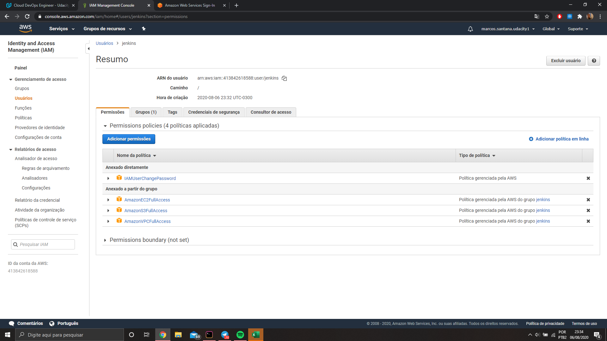
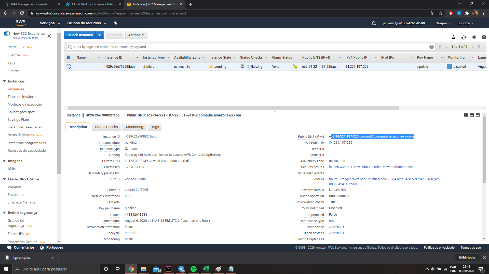
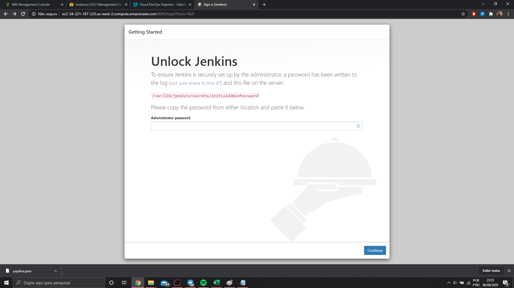
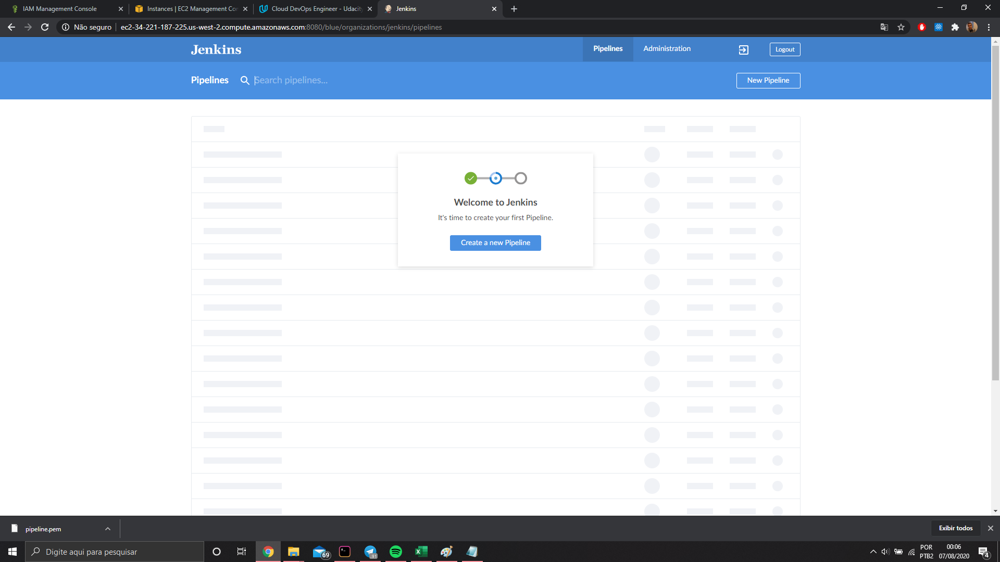
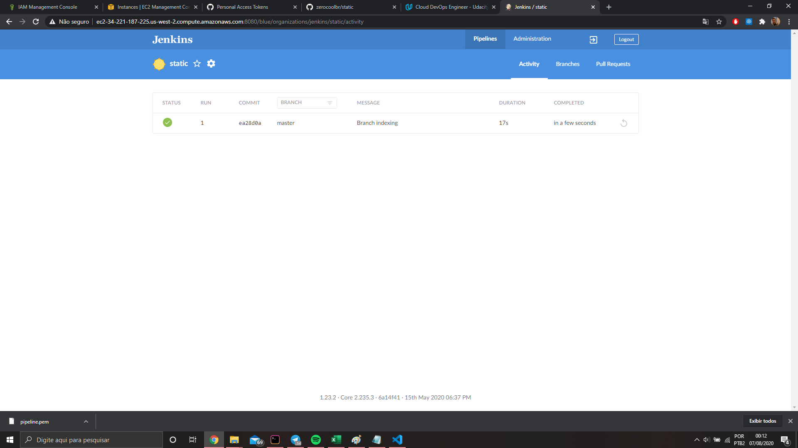
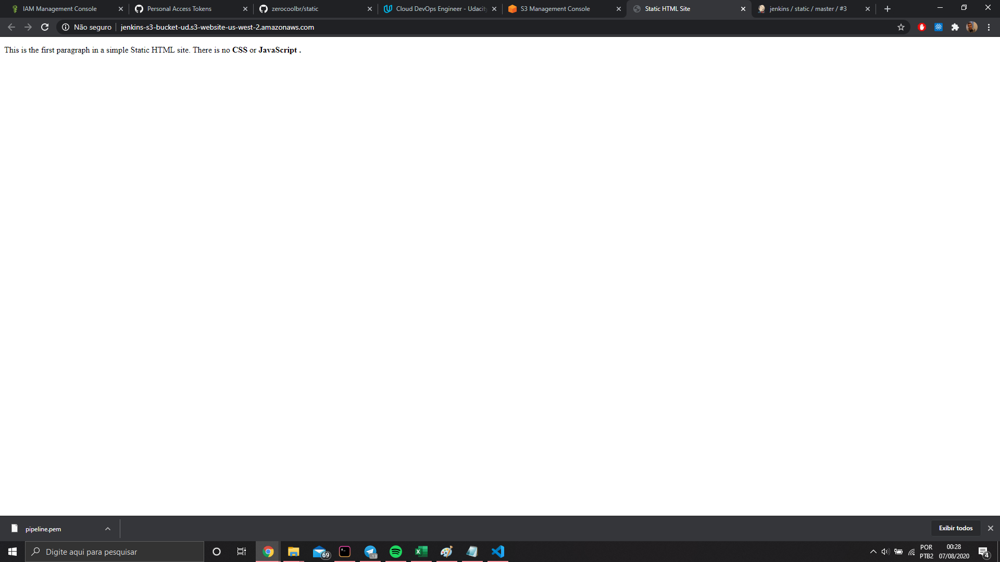
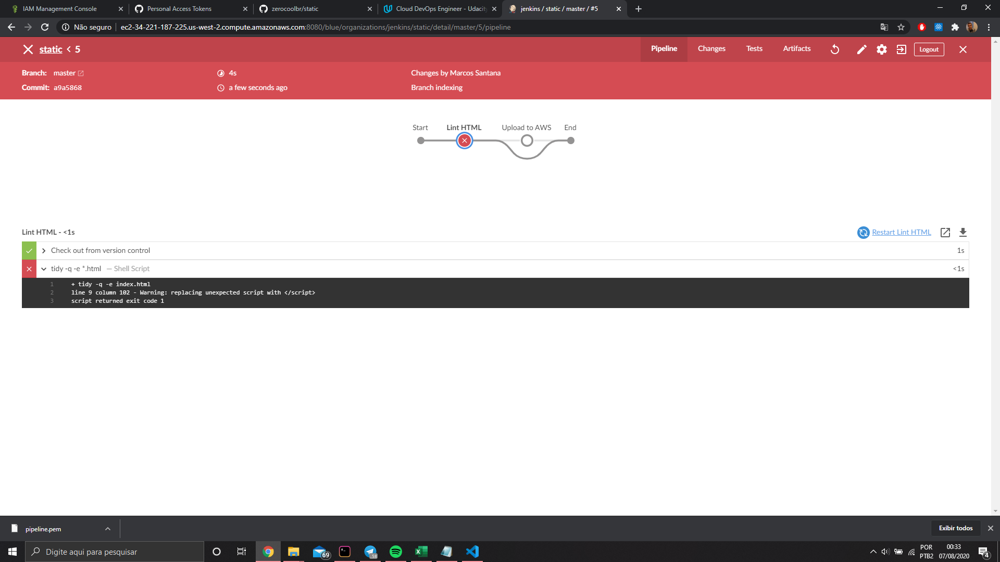
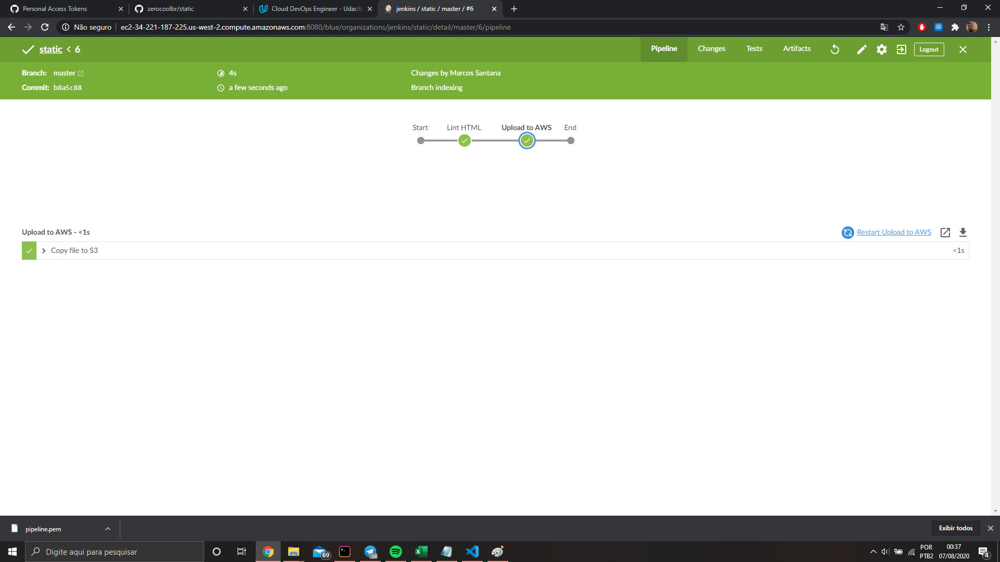

<h1 align="center">Bem-vindo ao Jenkins CI/CD 👋</h1>

  

> Esse repositório possui instruções de como criar uma pipeline em Jenkins para CI/CD. Usaremos apenas um arquivo index.html representando um website para demonstrar o passo a passo.

## Dependências

- [x] [Conta na AWS](https://aws.amazon.com/pt/console/)

## Instruções

1. Criar um usuário no IAM com as seguintes permissões
   

2. Criar uma instância EC2
   

3. Após criar a instância, logue via SSH e faça a instalação do Jenkins. Existem muitas maneiras de fazer isso. Veja o seguinte [tutorial](https://www.jenkins.io/doc/book/installing/). Após a instalação, abra a aplicação em um navegador e insira a key. É necessário realizar a instalação do [tidy](https://www.html-tidy.org/) também
   

4. Após a instalação estar concluída, instale o [Blue Ocean](https://www.jenkins.io/doc/book/blueocean/). Após a instalação você irá conseguir entrar nele através do dashboard do Jenkins
   

5. Crie uma pipeline via o Blue Ocean seguindo as instruções, caso tenha dificuldades você pode consultar esse [tutorial](https://www.jenkins.io/doc/book/blueocean/creating-pipelines/). Lembre-se que você precisa do [Jenkinsfile](Jenkinsfile) no seu repositório, ele terá todos os estágios e passos da pipeline
   

6. Após a pipeline criada ela será executada. Após a execução, o arquivo [index.html](index.html) será disponibilizado via S3 bucket e será possível acessa-lo via navegador
   

7. A pipeline usa um linter ([tidy](https://www.html-tidy.org/)) para verificar se há erros no arquivo [index.html](index.html). Caso houver erros, a pipeline irá falhar e o deploy não será efetuado
   

8. Concertando os erros no arquivo [index.html](index.html) a pipeline irá voltar a funcionar normalmente e o deploy será realizado
   

É importante lembrar que cada push no repositório remoto irá ativar a pipeline!

## Autor

👤 **Marcos Santana**

- LinkedIn: [@marcosbrs](https://linkedin.com/in/marcosbrs)
- Medium: [@marcos.brs](https://medium.com/@marcos.brs)
- Twitter: [@mbrsantana](https://twitter.com/mbrsantana)

## 📝 License

Copyright © 2020 [Marcos Santana](https://github.com/zerocoolbr). 
This project is [MIT](LICENSE) licensed.
